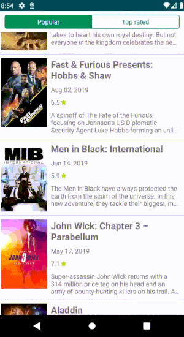

# Movify

Demo app how to use Android Networking and incorporate modern libraries

## Introduction

  This project followed a MVVM approach to handle the data synchronization by repository which executed asynchronously by Kotlin Coroutines and used Dagger 2 for dependency injection.
  
  

## Libraries used

* [Moshi](http://square.github.io/moshi/1.x/moshi/) - A modern JSON library for Kotlin and Java
* [Retrofit](https://square.github.io/retrofit/) - A type-safe HTTP client for Android and Java
* [Okhttp](http://square.github.io/okhttp/) - An HTTP client for Android, Kotlin, and Java 
* [Kotlin Coroutines](https://developer.android.com/kotlin/coroutines) - A concurrency design pattern 
* [Navigation Component](https://developer.android.com/guide/navigation/navigation-getting-started) -  A component that helps to navigate between fragments and activities 
* [Dagger 2](https://github.com/google/dagger) - A fast dependency injector for Android and Java


### Api Reference
You have to create and put your api key into local.properties in the root of the project
```
tmdb_api_key = "xxxxxxxxxxxxxxxxxxxxxxxxxxxxxxxx"
```
https://www.themoviedb.org/documentation/api


## License

This project is licensed under the MIT License - see the [LICENSE.md](LICENSE.md) file for details

